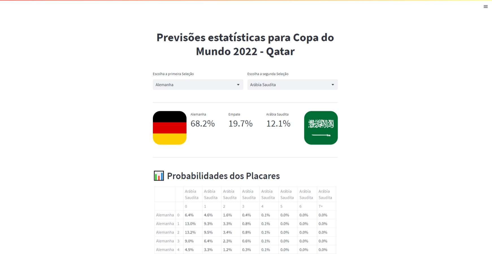

<h1 align="center">📊 Previsões estatísticas para Copa do Mundo 2022 - Qatar</h1>

  <strong>Projeto criado no curso Data Science na copa do mundo da FLAI, uma IA que prevê resultados de jogos</strong>
   

  

### Site 💻

- [Previsões Estatísticas](https://matheusdias20-probabilidade-copa-partida-mdkdt5.streamlit.app/)

## Linguagens & Tecnologias: 🚀
- Google Colab
- Streamlit
- Python
